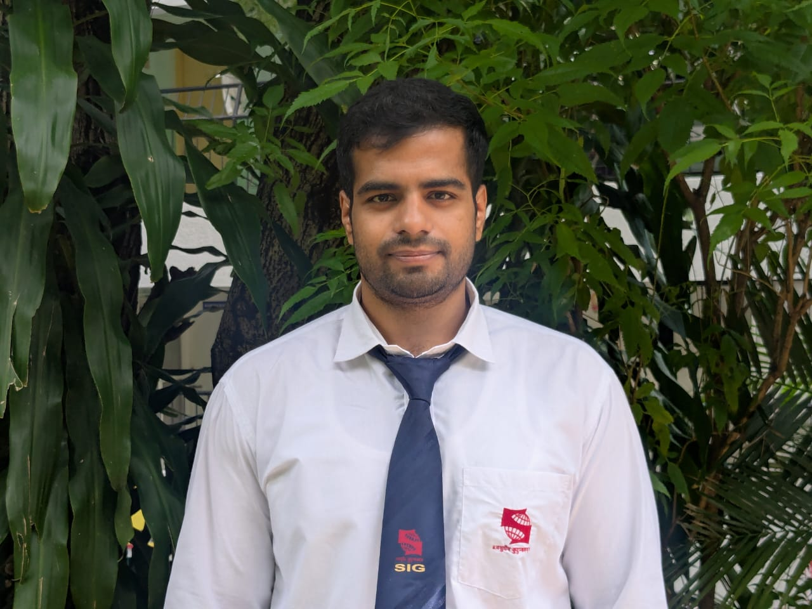
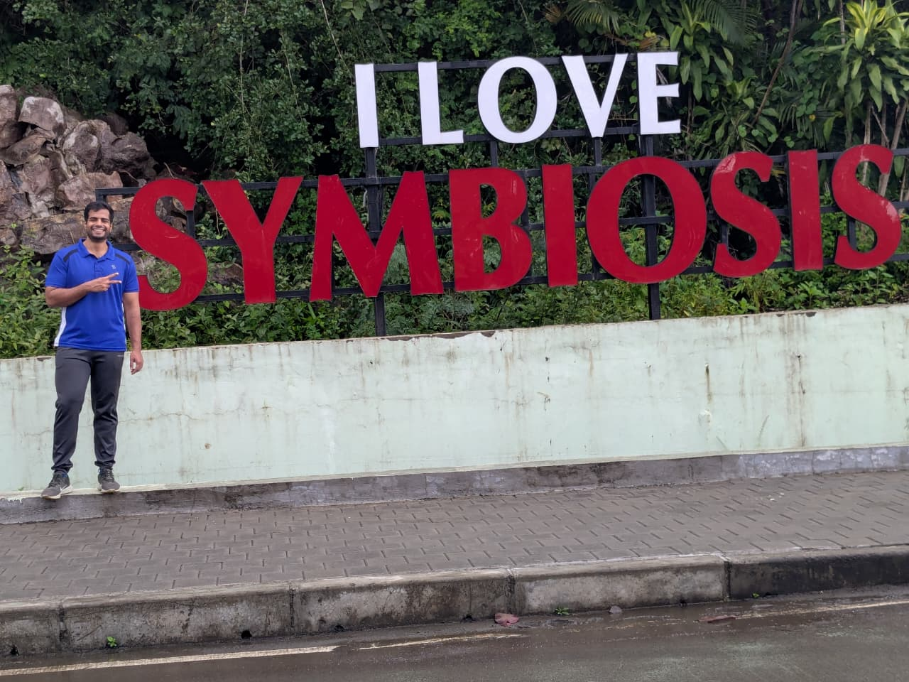

---
hide:
  - toc
---

  
  <h1>Manas Ranjan Patra</h1>
  
<strong>Geospatial Data Scientist</strong>

  
<em>Turning spatial data into insights | GIS · Remote Sensing · Python</em>

---

## About Me

I am a geologist-turned-geospatial data scientist currently pursuing an M.Sc. in Data Science and Spatial Analytics (Geointelligence) at Symbiosis Institute of Geoinformatics, Pune. I specialise in extracting actionable spatial insights from satellite imagery and large geospatial datasets using Python, Google Earth Engine, and open-source GIS tools. My work spans infrastructure planning, disaster management, and environmental intelligence. I am actively seeking opportunities in geospatial data science and remote sensing analytics.

  

---

[View My Projects :material-arrow-right:](projects/index.md){ .md-button .md-button--primary }
[Download CV :material-download:](assets/manas-CV.pdf){ .md-button }

---

## Skills

-   :material-layers:{ .lg .middle } **GIS & Remote Sensing**

    ---

    - ArcGIS Pro, QGIS, Google Earth Engine (GEE)
    - GDAL / OGR, rasterio, GeoServer

-   :material-code-braces:{ .lg .middle } **Programming**

    ---

    - Python — GeoPandas, NumPy, Pandas, Matplotlib, Scikit-learn
    - Spatial libraries — pySAL, Geoplot, xarray, rasterio
    - R, SQL, PL/pgSQL

-   :material-star-four-points:{ .lg .middle } **Machine Learning & Spatial Analysis**

    ---

    - Supervised classification with Scikit-learn
    - Spatial statistics with pySAL

-   :material-earth:{ .lg .middle } **Web Mapping & Visualisation**

    ---

    - Mapping and data visualisation with Python
    - Geoplot, Matplotlib, Folium

-   :material-database:{ .lg .middle } **Databases & Big Data**

    ---

    - PostgreSQL + PostGIS, DuckDB
    - Hadoop, MongoDB
    - PL/pgSQL

-   :material-cloud:{ .lg .middle } **Developer Tools & Cloud**

    ---

    - Git, GitHub, Docker
    - Microsoft Azure
    - Visual Studio Code, Jupyter Notebook

---

## Connect

[GitHub](https://github.com/manasthepatra/){ .md-button }
[LinkedIn](https://linkedin.com/in/manas-ranjan-patra-4b1b88226/){ .md-button }
