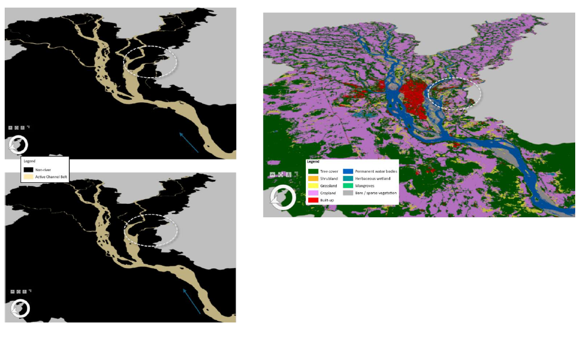

# Assessment of Active Channel Belt Extent in the Mahanadi River Using Google Earth Engine

## Overview

A multi-decadal geospatial analysis of active channel belt dynamics along the Mahanadi River in Cuttack district, Odisha, using Google Earth Engine and 30 years of Landsat satellite imagery to detect, quantify, and interpret fluvial geomorphic change.

**Study Area:** Mahanadi River and its distributaries, Cuttack District, Odisha (20°03'–20°40'N, 84°58'–86°20'E)
**Duration:** January 2024 – May 2024
**Role:** Solo project (M.Sc. Thesis, under supervision of Dr. Haridas Mohanta)
**Status:** Completed

---

## Methods & Tools

**Data Sources**

- Landsat 5 TM, Landsat 7 ETM+, Landsat 8 OLI/TIRS — Surface reflectance imagery (30 m, 1992–2022), Google Earth Engine Data Catalog
- Copernicus ESA WorldCover — Global land use land cover dataset (10 m resolution, 2020–2021)
- Bing Aerial Imagery via ArcGIS Pro — High-resolution imagery for sand mining reconnaissance
- Field photographs and ground truth data collected at Kuakhai River bridge sites, April 2024

**Processing Steps**

1. Defined region of interest (Cuttack District) and filtered Landsat Collections 1/2 for post-monsoon periods at decadal intervals (1992, 2002, 2012, 2022)
2. Applied CFmask cloud masking algorithm to remove cloud and cloud shadow pixels from all imagery
3. Generated median composite images per epoch to produce temporally stable, cloud-free spectral mosaics
4. Classified wetted channel extent using multispectral indices — MNDWI ≥ −0.4 and NDVI ≤ 0.2 — to isolate active water and alluvial deposit pixels
5. Combined wetted channel and alluvial deposit binary masks to produce active channel belt masks; applied morphological cleaning to remove disconnected noise pixels
6. Calculated pixel-based area statistics within GEE and exported binary GeoTIFF masks for cartographic output in ArcGIS Pro
7. Corroborated channel loss with Copernicus WorldCover LULC data and conducted pre-monsoon field validation at identified change sites

**Tools Used**

| Tool | Purpose |
|------|---------|
| Google Earth Engine (JavaScript API) | Cloud-based imagery processing, index computation, binary mask generation, area statistics |
| ArcGIS Pro | Cartographic output, map production, sand mining footprint mapping from Bing Aerial Imagery |
| Microsoft Excel | Area data export, decadal trend plotting and charting |
| Python | Supplementary data handling and analysis |

---

## Key Findings

- The active channel belt area declined by **~13%** over 30 years — from **354 sq. km in 1992** to **308 sq. km in 2022**
- Decline was steady at ~10 sq. km per decade from 1992–2012, but accelerated sharply to a **24 sq. km loss** in the final decade (2012–2022)
- Significant channel **fragmentation and longitudinal disconnectivity** was identified in the Kuakhai distributary in the southeastern portion of Cuttack district
- LULC analysis confirmed former active channel areas have been replaced by **shrubland and grassland**, indicating vegetation encroachment on abandoned channel belts
- Field validation and aerial imagery identified **rampant sand mining** in the active channel belt as a key anthropogenic driver of channel degradation and contraction
- Demonstrated the applicability of **Google Earth Engine as a scalable cloud computing platform** for multi-decadal planimetric river channel assessment

---

## Links

[View Thesis Report (PDF)](../assets/files/1_MSc_Project_Report-2024.pdf){ .md-button }
